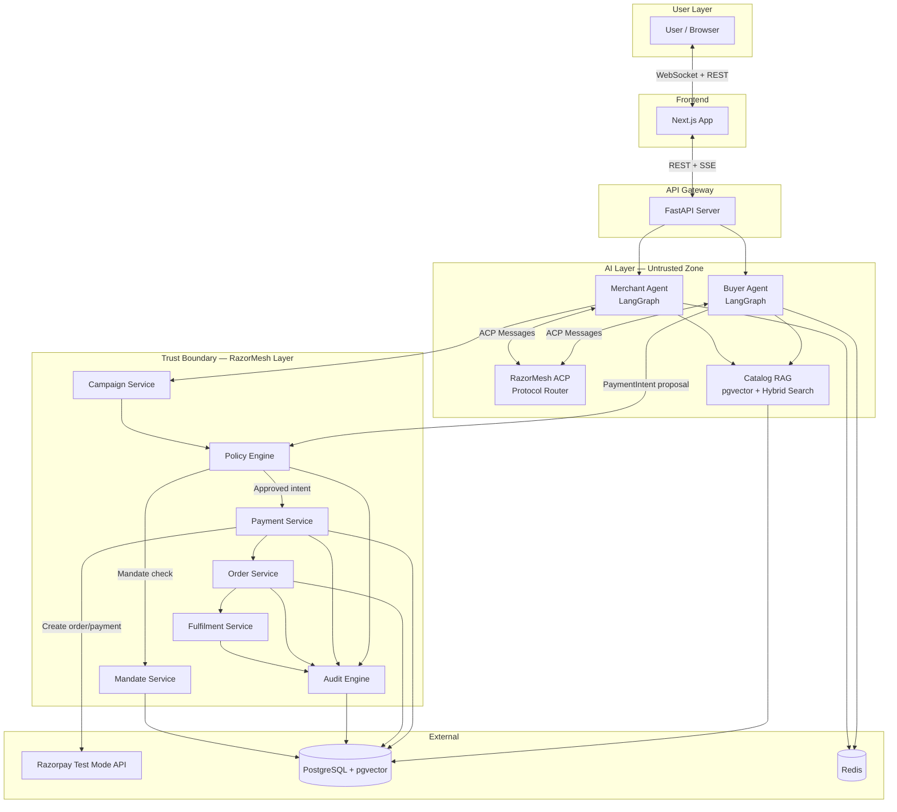
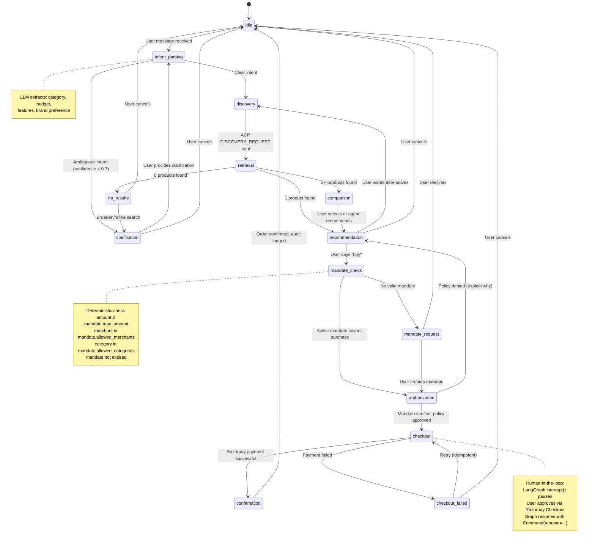
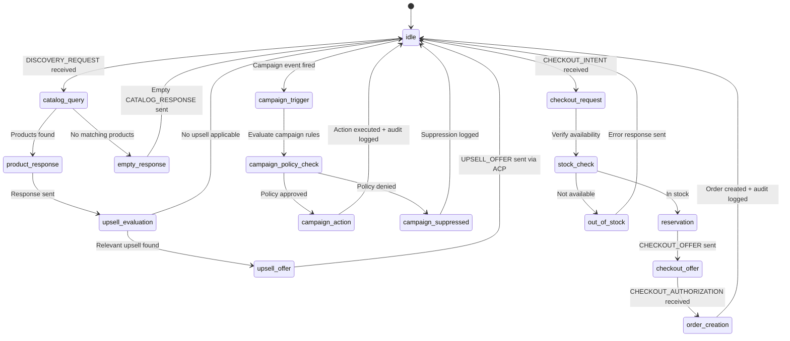
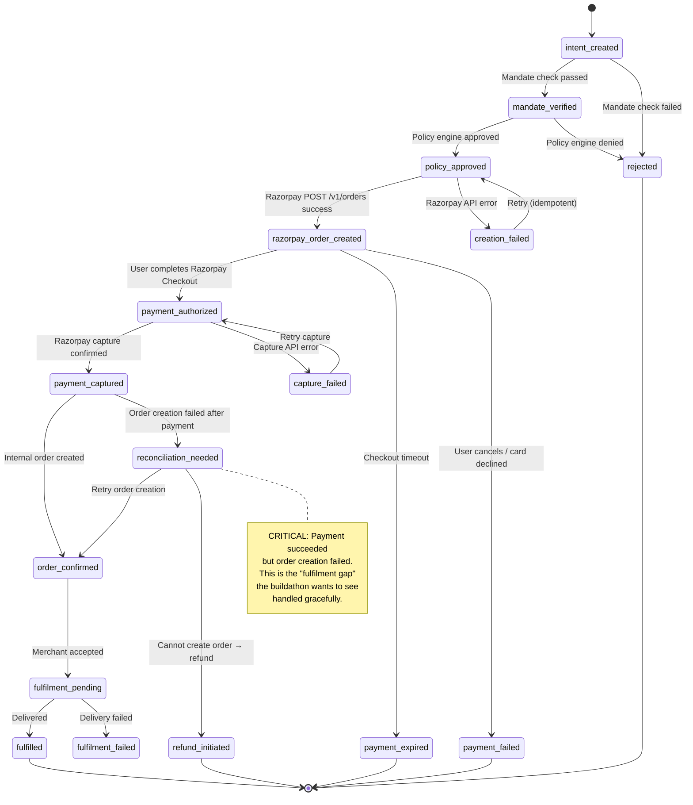
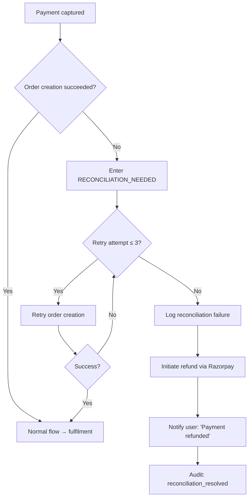
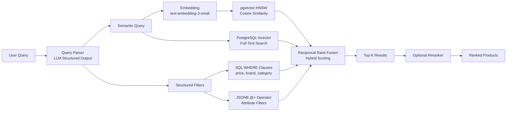
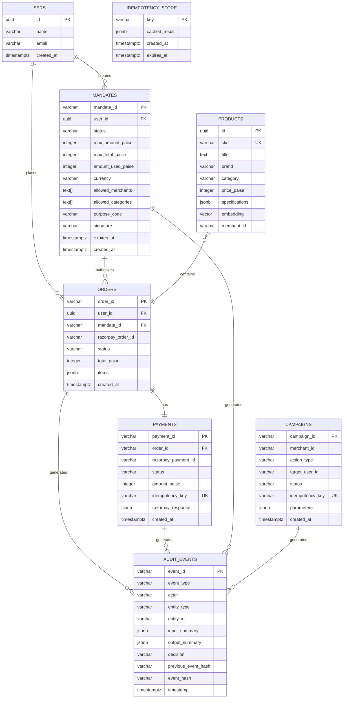

# RazorMesh Architecture

> System design document for the RazorMesh agentic commerce prototype.

---

## 1. System Overview

RazorMesh is a **two-agent commerce system** with a **deterministic trust boundary** between AI reasoning and financial execution.



### Design Principles

1. **LLM as untrusted input** — All LLM outputs are proposals, never commands
2. **Deterministic trust boundary** — Policy engine is pure code, no LLM in validation path
3. **Credential isolation** — LLM never sees API keys, tokens, or payment credentials
4. **Idempotent money operations** — Every financial mutation has an idempotency key
5. **Auditable everything** — Hash-chained append-only event log
6. **State-machine governance** — Explicit states and valid transitions for all entities
7. **Graceful failure** — Every failure mode has a defined recovery path

---

## 2. Repository Structure

```
razormesh-agentic-commerce/
├── README.md
├── docs/
│   ├── ARCHITECTURE.md          # This document
│   ├── PROTOCOL.md              # ACP message schemas
│   ├── PAYMENTS.md              # Payment analysis & design
│   ├── SECURITY.md              # Security architecture
│   ├── DEMO_FLOW.md             # Demo scenario
│   └── IMPLEMENTATION_PLAN.md   # Build phases
│
├── docker-compose.yml           # PostgreSQL, Redis, app
├── pyproject.toml               # Python dependencies (uv/poetry)
├── alembic.ini                  # DB migrations
│
├── src/
│   ├── __init__.py
│   │
│   ├── core/                    # Shared infrastructure
│   │   ├── config.py            # Pydantic Settings (env vars)
│   │   ├── database.py          # asyncpg pool, SQLAlchemy async
│   │   ├── redis.py             # Redis client
│   │   └── security.py          # HMAC, signature utils
│   │
│   ├── models/                  # Pydantic domain models (shared)
│   │   ├── catalog.py           # Product, Category, Attributes
│   │   ├── mandate.py           # Mandate, MandateConstraints
│   │   ├── order.py             # Order, OrderItem, OrderStatus
│   │   ├── payment.py           # PaymentIntent, PaymentResult
│   │   ├── protocol.py          # ACP Envelope, MessageType
│   │   ├── audit.py             # AuditEvent, EventType
│   │   ├── campaign.py          # Campaign, CampaignAction
│   │   └── user.py              # User, Session
│   │
│   ├── db/                      # Database layer
│   │   ├── tables.py            # SQLAlchemy table definitions
│   │   ├── migrations/          # Alembic migrations
│   │   └── seed.py              # Demo data seeding
│   │
│   ├── agents/                  # LangGraph agent workflows
│   │   ├── buyer/
│   │   │   ├── graph.py         # Buyer StateGraph definition
│   │   │   ├── nodes.py         # Node handler functions
│   │   │   ├── state.py         # BuyerState TypedDict
│   │   │   └── prompts.py       # System prompts
│   │   │
│   │   ├── merchant/
│   │   │   ├── graph.py         # Merchant StateGraph definition
│   │   │   ├── nodes.py         # Node handler functions
│   │   │   ├── state.py         # MerchantState TypedDict
│   │   │   └── prompts.py       # System prompts
│   │   │
│   │   └── orchestrator.py      # Master graph coordinating both agents
│   │
│   ├── protocol/                # ACP protocol layer
│   │   ├── router.py            # Message routing between agents
│   │   ├── envelope.py          # Envelope creation, validation
│   │   └── handlers.py          # Message type handlers
│   │
│   ├── rag/                     # Catalog search & RAG pipeline
│   │   ├── embeddings.py        # Embedding client
│   │   ├── hybrid_search.py     # pgvector + FTS + JSONB search
│   │   ├── query_parser.py      # LLM structured query extraction
│   │   └── reranker.py          # Result reranking
│   │
│   ├── services/                # Trust boundary services
│   │   ├── policy_engine.py     # Deterministic policy evaluation
│   │   ├── mandate_service.py   # Mandate CRUD & verification
│   │   ├── payment_service.py   # Payment orchestration
│   │   ├── order_service.py     # Order lifecycle
│   │   ├── fulfilment_service.py # Fulfilment state management
│   │   ├── campaign_service.py  # Campaign orchestration
│   │   └── audit_service.py     # Audit event logging
│   │
│   ├── adapters/                # External service adapters
│   │   └── razorpay_adapter.py  # Razorpay API client (Test Mode)
│   │
│   └── api/                     # FastAPI application
│       ├── main.py              # App factory, lifespan
│       ├── deps.py              # Dependency injection
│       └── v1/
│           ├── chat.py          # SSE chat streaming
│           ├── checkout.py      # Payment authorization endpoints
│           ├── catalog.py       # Product catalog REST
│           ├── mandates.py      # Mandate management
│           ├── orders.py        # Order status
│           ├── audit.py         # Audit trail viewer
│           └── webhooks.py      # Razorpay webhook receiver
│
├── frontend/                    # Next.js app (Phase 3)
│   └── ...
│
├── tests/
│   ├── unit/
│   │   ├── test_policy_engine.py
│   │   ├── test_mandate_service.py
│   │   ├── test_payment_state.py
│   │   └── test_audit_chain.py
│   ├── integration/
│   │   ├── test_buyer_workflow.py
│   │   ├── test_checkout_flow.py
│   │   └── test_razorpay_adapter.py
│   └── conftest.py
│
├── scripts/
│   ├── seed_catalog.py          # Populate demo catalog
│   └── verify_audit.py          # Audit chain verification
│
└── .env.example                 # Required environment variables
```

---

## 3. System Boundaries

### 3.1 AI Zone (Untrusted)

Everything the LLM produces is a **proposal**. This zone contains:

| Component | Responsibility | Trust Level |
|-----------|---------------|-------------|
| Buyer Agent | Intent parsing, product comparison, recommendation | **Untrusted** — outputs are proposals |
| Merchant Agent | Catalog response, upsell suggestions, campaign decisions | **Untrusted** — outputs are proposals |
| RAG Pipeline | Product retrieval, query expansion | **Semi-trusted** — deterministic retrieval, LLM-parsed queries |
| ACP Router | Message routing between agents | **Trusted** — deterministic routing code |

### 3.2 Trust Boundary (RazorMesh Layer)

All proposals must pass through this layer before any side-effect occurs:

| Component | Responsibility |
|-----------|---------------|
| Policy Engine | Evaluates rules: budget, merchant, category, rate limits, duplicates |
| Mandate Service | Verifies active mandate covers the proposed purchase |
| Payment Service | Idempotent payment creation via Razorpay |
| Order Service | Order lifecycle state machine |
| Fulfilment Service | Fulfilment state tracking |
| Campaign Service | Campaign action execution with policy checks |
| Audit Engine | Append-only hash-chained event log |

### 3.3 External Zone

| Component | Trust Model |
|-----------|------------|
| Razorpay API | Trusted (verified via signature) |
| PostgreSQL | Trusted (local, authenticated) |
| Redis | Trusted (local, for caching/idempotency) |
| LLM Provider | Untrusted (API input/output only) |

---

## 4. Agent Responsibilities

### 4.1 Buyer Agent

**Role:** Represents the user's shopping interests. Conversational interface.

**Can do:**
- Parse natural language shopping intent
- Send DISCOVERY_REQUEST to Merchant Agent via ACP
- Compare returned products on specs, price, reviews
- Ask user clarifying questions
- Recommend a product with explanation
- Propose a purchase (structured PaymentIntent)
- Display mandate status, payment status, order status

**Cannot do:**
- Execute payments
- Access Razorpay credentials
- Modify mandates
- Bypass policy engine
- Make purchases without active mandate

### 4.2 Merchant Agent

**Role:** Represents a merchant/store. Manages catalog and campaigns.

**Can do:**
- Respond to catalog discovery requests
- Provide detailed product specifications
- Suggest upsell/cross-sell products (policy-bounded)
- Trigger campaign actions (coupon, reminder, review request)
- Confirm stock availability and pricing
- Issue reservation tokens for checkout

**Cannot do:**
- Charge customers directly
- Access buyer payment credentials
- Override policy engine decisions
- Send unlimited campaign messages (rate-limited)
- Modify product prices beyond policy-defined discount limits

---

## 5. Buyer Agent State Machine



### Buyer State Definition

```python
class BuyerState(TypedDict):
    messages: Annotated[list[BaseMessage], add_messages]
    session_id: str
    user_id: str
    status: Literal[
        "idle", "intent_parsing", "clarification", "discovery",
        "retrieval", "comparison", "recommendation", "mandate_check",
        "mandate_request", "authorization", "checkout",
        "checkout_failed", "confirmation"
    ]
    parsed_intent: Optional[dict]          # category, budget, features
    active_filters: dict                   # structured search filters
    retrieved_products: list[dict]         # from merchant via ACP
    compared_products: list[dict]          # scored/ranked
    selected_product: Optional[dict]       # user's choice
    active_mandate_id: Optional[str]       # mandate covering this purchase
    payment_intent: Optional[dict]         # proposed payment
    checkout_result: Optional[dict]        # Razorpay response
    order_id: Optional[str]
    error: Optional[str]
```

---

## 6. Merchant Agent State Machine



### Merchant State Definition

```python
class MerchantState(TypedDict):
    merchant_id: str
    request_id: str
    status: Literal[
        "idle", "catalog_query", "product_response", "empty_response",
        "upsell_evaluation", "upsell_offer", "campaign_trigger",
        "campaign_policy_check", "campaign_action", "campaign_suppressed",
        "checkout_request", "stock_check", "reservation",
        "checkout_offer", "out_of_stock", "order_creation"
    ]
    query_filters: dict
    matched_products: list[dict]
    reservation_token: Optional[str]
    reservation_expiry: Optional[datetime]
    upsell_candidates: list[dict]
    campaign_context: Optional[dict]
    policy_result: Optional[dict]
    order_id: Optional[str]
```

---

## 7. Payment State Machine



### Payment States (Enum)

```python
class PaymentStatus(str, Enum):
    INTENT_CREATED = "intent_created"
    MANDATE_VERIFIED = "mandate_verified"
    POLICY_APPROVED = "policy_approved"
    RAZORPAY_ORDER_CREATED = "razorpay_order_created"
    PAYMENT_AUTHORIZED = "payment_authorized"
    PAYMENT_CAPTURED = "payment_captured"
    ORDER_CONFIRMED = "order_confirmed"
    FULFILMENT_PENDING = "fulfilment_pending"
    FULFILLED = "fulfilled"
    REJECTED = "rejected"
    PAYMENT_FAILED = "payment_failed"
    PAYMENT_EXPIRED = "payment_expired"
    CREATION_FAILED = "creation_failed"
    CAPTURE_FAILED = "capture_failed"
    RECONCILIATION_NEEDED = "reconciliation_needed"
    REFUND_INITIATED = "refund_initiated"
    FULFILMENT_FAILED = "fulfilment_failed"
```

### Valid Transitions

```python
VALID_TRANSITIONS: dict[PaymentStatus, set[PaymentStatus]] = {
    PaymentStatus.INTENT_CREATED: {
        PaymentStatus.MANDATE_VERIFIED,
        PaymentStatus.REJECTED,
    },
    PaymentStatus.MANDATE_VERIFIED: {
        PaymentStatus.POLICY_APPROVED,
        PaymentStatus.REJECTED,
    },
    PaymentStatus.POLICY_APPROVED: {
        PaymentStatus.RAZORPAY_ORDER_CREATED,
        PaymentStatus.CREATION_FAILED,
    },
    PaymentStatus.RAZORPAY_ORDER_CREATED: {
        PaymentStatus.PAYMENT_AUTHORIZED,
        PaymentStatus.PAYMENT_FAILED,
        PaymentStatus.PAYMENT_EXPIRED,
    },
    PaymentStatus.PAYMENT_AUTHORIZED: {
        PaymentStatus.PAYMENT_CAPTURED,
        PaymentStatus.CAPTURE_FAILED,
    },
    PaymentStatus.PAYMENT_CAPTURED: {
        PaymentStatus.ORDER_CONFIRMED,
        PaymentStatus.RECONCILIATION_NEEDED,
    },
    PaymentStatus.ORDER_CONFIRMED: {
        PaymentStatus.FULFILMENT_PENDING,
    },
    PaymentStatus.FULFILMENT_PENDING: {
        PaymentStatus.FULFILLED,
        PaymentStatus.FULFILMENT_FAILED,
    },
    PaymentStatus.CREATION_FAILED: {
        PaymentStatus.POLICY_APPROVED,       # retry
    },
    PaymentStatus.CAPTURE_FAILED: {
        PaymentStatus.PAYMENT_AUTHORIZED,    # retry
    },
    PaymentStatus.RECONCILIATION_NEEDED: {
        PaymentStatus.ORDER_CONFIRMED,       # retry succeeded
        PaymentStatus.REFUND_INITIATED,      # cannot recover
    },
}
```

---

## 8. Mandate Model

A **mandate** is a bounded authorization created by the human user that defines the scope within which AI agents can propose purchases.

> **Honesty note:** This is our prototype mandate model, inspired by AP2 concepts. It is NOT an official AP2 implementation. See [PAYMENTS.md](PAYMENTS.md) for the full AP2 comparison.

```python
class Mandate(BaseModel):
    """User-created bounded purchase authorization."""
    mandate_id: str = Field(default_factory=lambda: f"mdt_{uuid4().hex[:16]}")
    user_id: str
    status: Literal["active", "used", "expired", "revoked"]
    created_at: datetime
    expires_at: datetime

    # Spending bounds
    max_amount_paise: int                    # Maximum per-transaction (in paise)
    max_total_paise: Optional[int] = None    # Maximum cumulative spend
    amount_used_paise: int = 0               # Running total
    currency: str = "INR"

    # Scope constraints
    allowed_merchants: list[str] = []        # Empty = any merchant
    allowed_categories: list[str] = []       # Empty = any category
    allowed_product_ids: list[str] = []      # Empty = any product
    max_quantity: Optional[int] = None

    # Purpose
    purpose: str                             # Human-readable description
    purpose_code: Literal[
        "one_time_purchase", "recurring_purchase",
        "category_budget", "merchant_budget"
    ]

    # Verification
    signature: str                           # HMAC-SHA256 of mandate contents
    used_idempotency_keys: list[str] = []    # Prevent reuse
```

### Mandate Verification (Deterministic)

```python
def verify_mandate(mandate: Mandate, intent: PaymentIntent) -> PolicyResult:
    """Pure function. No LLM. Returns APPROVED or DENIED with reasons."""
    reasons = []

    if mandate.status != "active":
        reasons.append(f"Mandate is {mandate.status}")
    if datetime.utcnow() > mandate.expires_at:
        reasons.append("Mandate has expired")
    if intent.amount_paise > mandate.max_amount_paise:
        reasons.append(f"Amount {intent.amount_paise} exceeds limit {mandate.max_amount_paise}")
    if mandate.max_total_paise and (mandate.amount_used_paise + intent.amount_paise) > mandate.max_total_paise:
        reasons.append("Would exceed cumulative spending limit")
    if mandate.allowed_merchants and intent.merchant_id not in mandate.allowed_merchants:
        reasons.append(f"Merchant {intent.merchant_id} not in allowed list")
    if mandate.allowed_categories and intent.category not in mandate.allowed_categories:
        reasons.append(f"Category {intent.category} not in allowed list")
    if intent.idempotency_key in mandate.used_idempotency_keys:
        reasons.append("Duplicate idempotency key")

    if reasons:
        return PolicyResult(decision="DENIED", reasons=reasons)
    return PolicyResult(decision="APPROVED", reasons=[])
```

---

## 9. Policy Engine

The policy engine is **deterministic code** — no LLM in the evaluation path.

### Rule Categories

| Rule | Type | Example |
|------|------|---------|
| Budget limit | Per-transaction | `amount ≤ 800000 paise (₹8,000)` |
| Daily limit | Aggregate | `daily_total ≤ 2000000 paise (₹20,000)` |
| Mandate coverage | Authorization | `active mandate covers this purchase` |
| Merchant allowlist | Scope | `merchant_id in mandate.allowed_merchants` |
| Category restriction | Scope | `category in mandate.allowed_categories` |
| Quantity limit | Scope | `quantity ≤ mandate.max_quantity` |
| Duplicate check | Idempotency | `idempotency_key not previously used` |
| Rate limit | Anti-abuse | `≤ 5 purchase attempts per hour` |
| Time restriction | Validity | `mandate.expires_at > now()` |
| Price drift | Safety | `offered_price ≤ 1.05 × catalog_price` |
| Campaign frequency | Merchant | `≤ 3 campaign messages per user per day` |
| Discount margin | Merchant | `discount ≤ 30% of base_price` |

### Policy Evaluation Flow

```python
class PolicyResult(BaseModel):
    decision: Literal["APPROVED", "DENIED", "REQUIRES_ESCALATION"]
    reasons: list[str]
    evaluated_rules: list[str]
    evaluation_time_ms: float

def evaluate_payment_policy(
    intent: PaymentIntent,
    mandate: Mandate,
    daily_spend: int,
    attempt_count: int,
    catalog_price: int,
) -> PolicyResult:
    """Deterministic. No LLM. No network calls. Pure business logic."""
    ...
```

---

## 10. Idempotency Strategy

### Key Structure

```
{operation_type}:{entity_id}:{attempt_sequence}
```

| Operation | Idempotency Key Pattern | Example |
|-----------|------------------------|---------|
| Checkout authorization | `checkout:{session_id}:{product_id}` | `checkout:sess_a1b2:prod_kb01` |
| Order creation | `order:{razorpay_order_id}` | `order:order_EKwxwAgItmmXdp` |
| Payment capture | `capture:{razorpay_payment_id}` | `capture:pay_FVmAstJW0K2OdS` |
| Fulfilment update | `fulfil:{order_id}:{status}` | `fulfil:ord_a1b2:shipped` |
| Campaign action | `campaign:{campaign_id}:{user_id}:{action}` | `campaign:camp_01:user_01:coupon` |

### Implementation

```python
async def execute_idempotent(
    key: str,
    operation: Callable,
    db: AsyncSession,
) -> tuple[Any, bool]:
    """
    Returns (result, was_duplicate).
    If key exists in idempotency_store, returns cached result.
    Otherwise executes operation, stores result, returns it.
    """
    existing = await db.get(IdempotencyRecord, key)
    if existing:
        return existing.cached_result, True  # was_duplicate=True

    result = await operation()
    record = IdempotencyRecord(key=key, cached_result=result, created_at=utcnow())
    db.add(record)
    await db.commit()
    return result, False
```

---

## 11. Fulfilment Gap Handling

### The Problem

Payment, order creation, and fulfilment are **separate operations** that can fail independently. The most dangerous case: payment succeeds but order creation fails.

### State Tracking

| State | Meaning | Next Steps |
|-------|---------|------------|
| `payment_captured` + `order_confirmed` | Happy path | Proceed to fulfilment |
| `payment_captured` + `order_creation_failed` | **Fulfilment gap** | Retry order creation → reconcile → or refund |
| `order_confirmed` + `fulfilment_failed` | Delivery problem | Retry fulfilment → escalate → refund |
| `payment_failed` + `order_created` | Shouldn't happen | Cancel order (defensive) |

### Reconciliation Process



---

## 12. Audit / Clearing Engine

### Event Structure

```python
class AuditEvent(BaseModel):
    event_id: str = Field(default_factory=lambda: f"evt_{uuid4().hex[:16]}")
    event_type: EventType
    timestamp: datetime = Field(default_factory=datetime.utcnow)
    actor: str                          # "buyer_agent", "merchant_agent", "policy_engine", "payment_service", "system"
    action: str                         # Human-readable action description
    entity_type: str                    # "mandate", "order", "payment", "campaign"
    entity_id: str                      # ID of the entity acted upon
    input_summary: dict                 # What was proposed/requested
    output_summary: dict                # What happened
    decision: Optional[str]             # "APPROVED", "DENIED", etc.
    metadata: dict = {}                 # Additional context
    previous_event_hash: str            # Hash of previous event (chain)
    event_hash: str                     # SHA-256 of this event's contents

class EventType(str, Enum):
    USER_REQUEST = "user_request"
    AGENT_PROPOSAL = "agent_proposal"
    ACP_MESSAGE = "acp_message"
    POLICY_EVALUATION = "policy_evaluation"
    MANDATE_CHECK = "mandate_check"
    MANDATE_CREATED = "mandate_created"
    PAYMENT_ATTEMPTED = "payment_attempted"
    PAYMENT_RESULT = "payment_result"
    RAZORPAY_WEBHOOK = "razorpay_webhook"
    ORDER_CREATED = "order_created"
    ORDER_STATUS_CHANGE = "order_status_change"
    FULFILMENT_UPDATE = "fulfilment_update"
    CAMPAIGN_ACTION = "campaign_action"
    RECONCILIATION = "reconciliation"
    ERROR = "error"
```

### Hash Chain

```python
def compute_event_hash(event: AuditEvent) -> str:
    """Tamper-evident hash chain. NOT blockchain — simple SHA-256 chain."""
    content = json.dumps({
        "event_id": event.event_id,
        "event_type": event.event_type,
        "timestamp": event.timestamp.isoformat(),
        "actor": event.actor,
        "action": event.action,
        "entity_type": event.entity_type,
        "entity_id": event.entity_id,
        "input_summary": event.input_summary,
        "output_summary": event.output_summary,
        "decision": event.decision,
        "previous_event_hash": event.previous_event_hash,
    }, sort_keys=True)
    return hashlib.sha256(content.encode()).hexdigest()

def verify_audit_chain(events: list[AuditEvent]) -> bool:
    """Verify the integrity of the audit chain."""
    for i, event in enumerate(events):
        expected_hash = compute_event_hash(event)
        if event.event_hash != expected_hash:
            return False
        if i > 0 and event.previous_event_hash != events[i-1].event_hash:
            return False
    return True
```

---

## 13. RAG Architecture

### Why RAG is Meaningful Here

The catalog isn't just documents — it's **structured product data** designed for machine reasoning. RAG enables:

1. **Semantic search**: "keyboard for coding" → matches products tagged with programming/developer use cases
2. **Attribute filtering**: price ≤ ₹6,000 AND switch_type = "mechanical"
3. **Specification comparison**: Agent compares weighted attributes across products
4. **Policy retrieval**: Return/refund policies, shipping info, warranty terms

### Hybrid Search Architecture



### Product Schema (AI-Readable)

```python
class ProductCatalogEntry(BaseModel):
    """Designed for machine reasoning, not human marketing."""
    product_id: str
    sku: str
    title: str
    brand: str
    category: str                    # Normalized taxonomy
    subcategory: str

    # Pricing
    price_paise: int                 # Always in smallest unit
    mrp_paise: int                   # Maximum retail price
    currency: str = "INR"

    # For semantic search
    description: str                 # Concise, factual description
    use_cases: list[str]             # ["programming", "gaming", "office"]
    key_features: list[str]          # ["hot-swappable", "wireless", "RGB"]

    # Structured attributes (JSONB)
    specifications: dict             # {"switch_type": "Cherry MX Brown", ...}

    # Availability
    stock_quantity: int
    in_stock: bool
    estimated_delivery_days: int

    # Quality signals
    rating: float                    # 0.0 - 5.0
    review_count: int

    # Merchant
    merchant_id: str
    merchant_name: str

    # Policies (for agent reasoning)
    return_policy: str               # "7-day no-questions return"
    warranty: str                    # "1 year manufacturer"
```

### Database Schema (PostgreSQL + pgvector)

```sql
CREATE EXTENSION IF NOT EXISTS vector;

CREATE TABLE products (
    id UUID PRIMARY KEY DEFAULT gen_random_uuid(),
    sku VARCHAR(64) UNIQUE NOT NULL,
    title TEXT NOT NULL,
    brand VARCHAR(100) NOT NULL,
    category VARCHAR(100) NOT NULL,
    subcategory VARCHAR(100),
    price_paise INTEGER NOT NULL,
    mrp_paise INTEGER NOT NULL,
    currency VARCHAR(3) DEFAULT 'INR',
    description TEXT NOT NULL,
    use_cases TEXT[] NOT NULL DEFAULT '{}',
    key_features TEXT[] NOT NULL DEFAULT '{}',
    specifications JSONB NOT NULL DEFAULT '{}',
    stock_quantity INTEGER NOT NULL DEFAULT 0,
    rating NUMERIC(3,2) DEFAULT 0.0,
    review_count INTEGER DEFAULT 0,
    merchant_id VARCHAR(64) NOT NULL,
    return_policy TEXT,
    warranty TEXT,

    -- Semantic search vector
    embedding vector(1536),

    -- Full-text search (auto-generated)
    tsv tsvector GENERATED ALWAYS AS (
        setweight(to_tsvector('english', coalesce(title, '')), 'A') ||
        setweight(to_tsvector('english', coalesce(brand, '')), 'B') ||
        setweight(to_tsvector('english', coalesce(description, '')), 'C')
    ) STORED,

    created_at TIMESTAMPTZ DEFAULT NOW(),
    updated_at TIMESTAMPTZ DEFAULT NOW()
);

CREATE INDEX idx_products_embedding ON products
    USING hnsw (embedding vector_cosine_ops) WITH (m = 16, ef_construction = 64);
CREATE INDEX idx_products_tsv ON products USING gin(tsv);
CREATE INDEX idx_products_specs ON products USING gin(specifications);
CREATE INDEX idx_products_category_price ON products(category, price_paise);
```

---

## 14. Database Entities

### Entity Relationship Diagram



---

## 15. API Boundaries

### Public API (Frontend ↔ Backend)

| Endpoint | Method | Purpose |
|----------|--------|---------|
| `/api/v1/chat/stream` | POST | SSE streaming chat with buyer agent |
| `/api/v1/chat/history/{session_id}` | GET | Chat history for session |
| `/api/v1/catalog/search` | POST | Direct catalog search |
| `/api/v1/catalog/products/{id}` | GET | Product details |
| `/api/v1/mandates` | POST | Create a new mandate |
| `/api/v1/mandates/{id}` | GET | Get mandate status |
| `/api/v1/mandates/{id}/revoke` | POST | Revoke a mandate |
| `/api/v1/checkout/authorize` | POST | Resume checkout after payment |
| `/api/v1/orders/{id}` | GET | Order status |
| `/api/v1/audit/trail/{entity_id}` | GET | Audit trail for entity |
| `/api/v1/audit/verify` | POST | Verify audit chain integrity |

### Internal Webhook

| Endpoint | Method | Purpose |
|----------|--------|---------|
| `/webhooks/razorpay` | POST | Razorpay payment webhooks |

### Razorpay Integration Boundary

| Our Service Calls | Razorpay Endpoint | Purpose |
|-------------------|-------------------|---------|
| `create_order()` | `POST /v1/orders` | Create payment order |
| `fetch_order()` | `GET /v1/orders/{id}` | Check order status |
| `fetch_payment()` | `GET /v1/payments/{id}` | Check payment status |
| `verify_signature()` | (local HMAC) | Verify webhook/checkout signature |

> **Boundary rule:** Only `razorpay_adapter.py` imports the `razorpay` SDK. No other module touches Razorpay directly.

---

## 16. Observability Strategy

### Logging

- Structured JSON logging via `structlog`
- Log levels: ERROR for failures, WARNING for policy denials, INFO for state transitions, DEBUG for agent reasoning
- **Never log:** API keys, payment credentials, full card numbers

### Metrics (Prototype-Appropriate)

- Request latency per endpoint
- Agent node execution time
- Policy engine evaluation count (approved vs denied)
- Razorpay API call count and latency
- Audit event count by type

### Health Checks

- `/health` — API server alive
- `/health/db` — PostgreSQL connected
- `/health/redis` — Redis connected
- `/health/razorpay` — Razorpay API reachable (test ping)

---

## 17. Testing Strategy

### Unit Tests

| Component | Test Focus |
|-----------|-----------|
| Policy engine | All rule combinations, edge cases |
| Mandate verification | Expired, over-budget, wrong merchant, duplicate |
| Payment state machine | All valid transitions, reject invalid |
| Audit hash chain | Chain integrity, tamper detection |
| ACP envelope | Serialization, validation |

### Integration Tests

| Scenario | Components |
|----------|-----------|
| Buyer discovery flow | Agent → ACP → Merchant → RAG → Response |
| Checkout flow | Agent → Policy → Mandate → Razorpay (mocked) → Order |
| Failure handling | Payment success → Order fail → Reconciliation |
| Campaign trigger | Event → Campaign service → Policy → Action |

### API Tests

- All endpoints with valid/invalid inputs
- Razorpay webhook with valid/invalid signatures
- Idempotency: duplicate requests return cached results

### Razorpay Tests

- Real Razorpay Test Mode API calls (not mocked)
- Test card: `4111 1111 1111 1111`
- Test UPI: `success@razorpay` / `failure@razorpay`
- Verify signature on webhook responses

---

## 18. Technology Decisions

| Decision | Choice | Rationale |
|----------|--------|-----------|
| Language | Python 3.12 | LangChain/LangGraph ecosystem, FastAPI, team skill |
| Web framework | FastAPI | Async, Pydantic-native, SSE support |
| Agent framework | LangGraph | Stateful workflows, human-in-the-loop, checkpointing |
| Database | PostgreSQL 16 | Relational + pgvector + JSONB + FTS in one system |
| Vector search | pgvector (HNSW) | No separate vector DB needed, good enough for demo scale |
| Cache | Redis | Idempotency keys, session cache, rate limiting |
| Validation | Pydantic v2 | Shared models between API, agents, DB |
| Payment | Razorpay Python SDK | Required for buildathon, test mode available |
| Frontend | Next.js 14 | React, TypeScript, SSE consumption |
| Container | Docker Compose | PostgreSQL + Redis + app, single command setup |
| Migrations | Alembic | Standard SQLAlchemy migration tool |
| Testing | pytest + httpx | Async test support, FastAPI test client |
