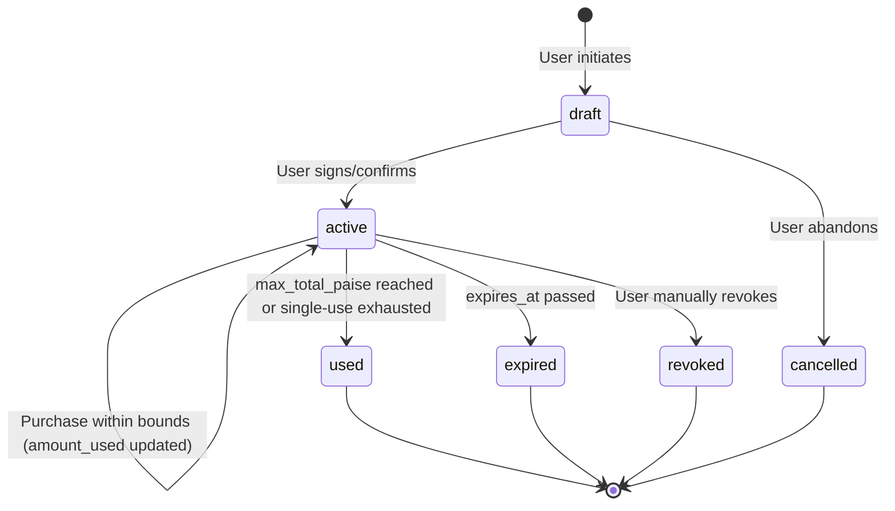
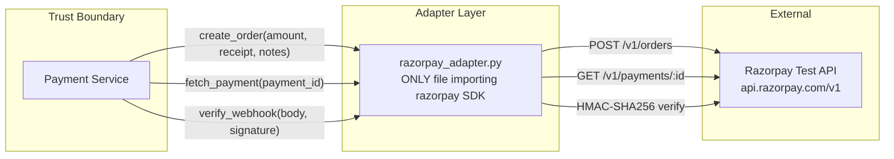
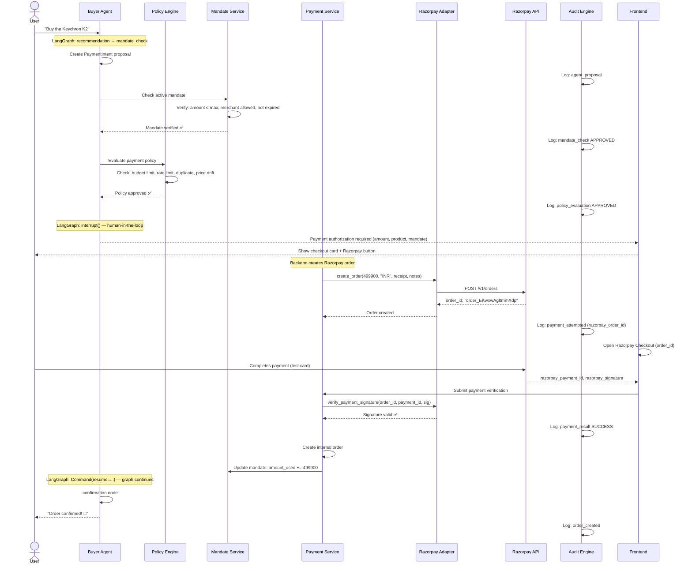
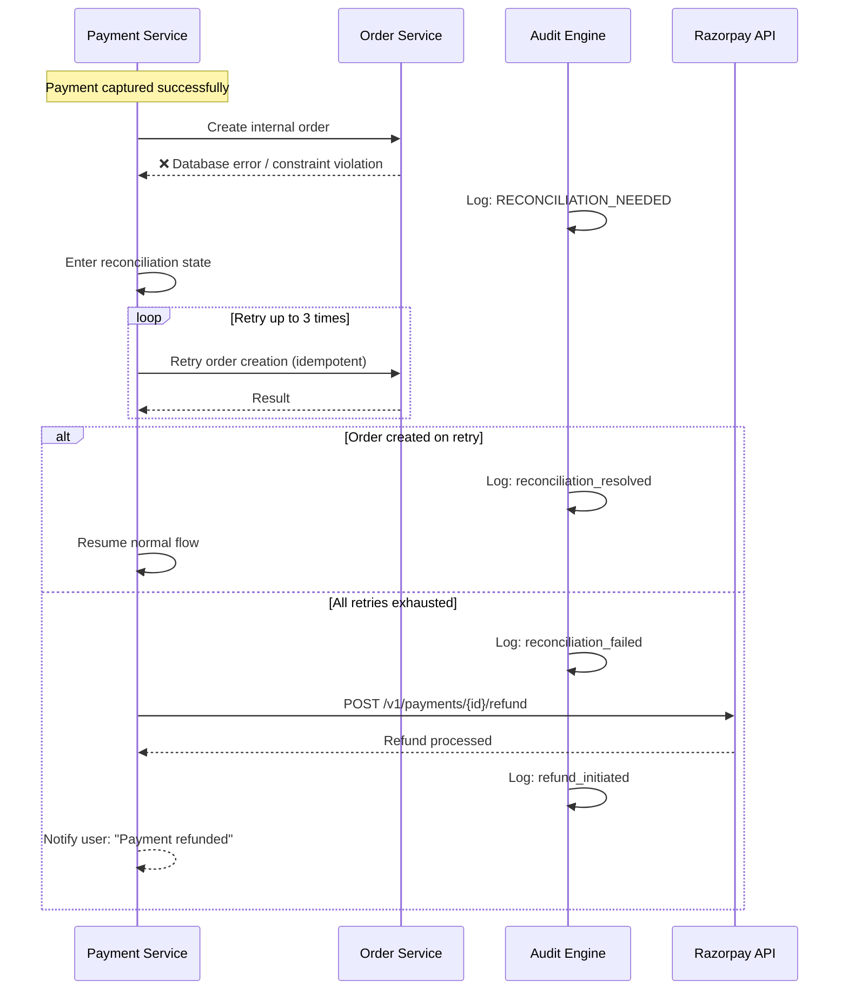

# RazorMesh Payment Architecture

> Payment protocol analysis, mandate model design, and Razorpay integration boundary.

---

## 1. Payment Protocol Landscape (August 2026)

Before choosing an approach, we surveyed the emerging agentic payment ecosystem honestly.

### 1.1 Protocols Evaluated

| Protocol | Backers | Primary Focus | Status |
|----------|---------|---------------|--------|
| **AP2** (Agent Payments Protocol) | Google, FIDO Alliance, Mastercard, PayPal | Cryptographic mandate-based authorization for agent-initiated payments | Real spec, early standardization. Reference impls on GitHub. Banks not yet natively supporting. |
| **ACP** (Agentic Commerce Protocol) | OpenAI, Stripe, Meta | Merchant checkout & catalog interaction for AI agents | Real spec at agenticcommerce.dev. Stripe-centric. |
| **x402** | Coinbase, Cloudflare | HTTP-native machine-to-machine stablecoin micropayments | Production for API monetization. USDC/blockchain-dependent. |
| **UCP** (Universal Commerce Protocol) | Google, Shopify | Full commerce journey — discovery to post-purchase | Emerging standard, openly licensed. |
| **UPI AutoPay / e-Mandate** | NPCI, RBI | Recurring/delegated INR payments with regulatory compliance | Production in India. ₹15,000/txn AFA-free limit. |
| **Razorpay Orders + Checkout** | Razorpay | Standard e-commerce payment processing | Production. Test Mode available. |

---

## 2. AP2 Deep Dive: What It Actually Is

### 2.1 Official Status

AP2 is a **real, published protocol specification** — not a concept paper. Key facts:

- Introduced by Google in September 2025
- Contributed to the **FIDO Alliance** in April 2026
- Open-source reference implementations exist (Python, Go) at `google-agentic-commerce/AP2`
- Over 60 industry partners including Mastercard, PayPal, Adyen, Coinbase
- Based on **W3C Verifiable Credentials (VCs)** with asymmetric key signatures (Ed25519/ECDSA)

### 2.2 AP2 Mandate Architecture

AP2's core innovation is a 3-tier chain of cryptographic **mandates**:

```
┌─────────────────────┐     ┌─────────────────────┐     ┌─────────────────────┐
│   Intent Mandate     │────▶│    Cart Mandate      │────▶│  Payment Mandate     │
│                      │     │                      │     │                      │
│ • User's rules/caps  │     │ • Specific items     │     │ • Fund disbursement  │
│ • Budget limit       │     │ • Exact prices       │     │ • References Intent  │
│ • Category scope     │     │ • Merchant signature  │     │   + Cart hashes      │
│ • Expiry             │     │ • Shipping address    │     │ • Sent to processor  │
│ • Signed by user     │     │ • User co-signs (HITL)│     │ • Signed chain       │
└─────────────────────┘     └─────────────────────┘     └─────────────────────┘
```

1. **Intent Mandate** — User defines constraints: "Spend up to ₹5,000 on electronics from Zepto before Friday." Digitally signed by user.
2. **Cart Mandate** — Created when agent selects specific items. Contains exact SKUs, prices, merchant. User co-signs for HITL flows.
3. **Payment Mandate** — Authorizes actual fund movement. Cryptographically references both Intent and Cart hashes, binding payment to verified intent.

### 2.3 What AP2 Does vs What Banks Support

| Capability | AP2 Spec | Bank/Processor Support (Aug 2026) |
|-----------|----------|-----------------------------------|
| Intent Mandate creation & signing | ✅ Specified | ❌ Banks don't verify AP2 VCs natively |
| Cart Mandate with merchant binding | ✅ Specified | ❌ No bank validates cart mandates |
| Payment Mandate → processor | ✅ Specified | 🟡 Pilot programs with Mastercard |
| Cryptographic signature verification | ✅ Ed25519/ECDSA | ❌ Processors use existing auth (3DS, OTP) |
| W3C Verifiable Credentials format | ✅ JSON-LD | ❌ No bank parses VCs for payments |

**Bottom line:** AP2 mandates are a robust trust framework, but the "last mile" — bank-side verification — doesn't exist yet in production. Our prototype implements the mandate logic while using Razorpay for actual payment execution.

---

## 3. x402 Deep Dive: What It Actually Is

### 3.1 How x402 Works

x402 revives the HTTP 402 "Payment Required" status code for machine-to-machine payments:

```
Agent ──GET /api/data──▶ Server
       ◀── HTTP 402 ───  (price: $0.01 USDC, recipient wallet, chain: Base)
       
Agent signs EIP-3009 transferWithAuthorization (no gas spent by agent)
       
Agent ──GET /api/data──▶ Server
       + X-PAYMENT header (signed authorization)
       
Server ──POST /verify──▶ Facilitator (Coinbase CDP)
       ◀── Valid ────────
Server ──POST /settle──▶ Facilitator
       ◀── tx_hash ─────  (on-chain settlement)
       
       ◀── HTTP 200 ────  Agent receives data
```

### 3.2 x402 Strengths

- **Zero-registration**: No API keys or accounts needed
- **Synchronous**: Payment and data delivery in same HTTP request-response
- **Sub-cent viable**: L2 networks (Base, Solana) make micropayments economical
- **Production-ready**: Coinbase CDP SDK, Nevermined, thirdweb all have working implementations

### 3.3 x402 Limitations for Our Use Case

| Limitation | Detail |
|-----------|--------|
| **Blockchain dependency** | Requires USDC on EVM chains. No native INR support. |
| **No pre-auth/capture** | Atomic transfer — no hold, verify, then charge pattern |
| **No chargebacks/disputes** | Blockchain transactions are final and immutable |
| **No cart/order context** | Designed for single-price API calls, not itemized e-commerce |
| **Indian regulatory barriers** | RBI does not permit crypto as payment for goods/services. 30% VDA tax + 1% TDS. |
| **No AFA compliance** | Violates RBI Additional Factor of Authentication requirements |
| **Currency mismatch** | Indian consumers pay in INR; x402 settles in USDC |

---

## 4. Comparative Analysis: AP2 vs x402 vs UPI vs Razorpay

### 4.1 Decision Matrix

| Criterion | AP2-Style Mandate | x402 | UPI AutoPay | Razorpay Orders |
|-----------|:----------------:|:----:|:-----------:|:---------------:|
| **Consumer e-commerce fit** | ✅ Designed for it | ❌ API/M2M only | ✅ Indian standard | ✅ Industry standard |
| **Agent delegation model** | ✅ Core feature | 🟡 Wallet-based | 🟡 UPI Circle | ❌ Human checkout |
| **INR native** | ✅ Currency agnostic | ❌ USDC only | ✅ INR native | ✅ INR native |
| **RBI compliant** | ✅ Adaptable | ❌ Crypto barriers | ✅ Fully compliant | ✅ Fully compliant |
| **Pre-auth / capture** | ✅ Via mandate chain | ❌ Atomic transfer | 🟡 Limited | ✅ Native |
| **Dispute / refund** | ✅ Built in | ❌ Manual reverse tx | ✅ Standard | ✅ Standard |
| **Auditable intent chain** | ✅ Cryptographic | 🟡 Blockchain log | ❌ Transaction only | ❌ Order status only |
| **Buildathon demo-ability** | ✅ Compelling story | 🟡 Cool but irrelevant | 🟡 Real but boring | ✅ Required anyway |
| **Implementation complexity** | Medium | High (Web3 stack) | Medium (NPCI APIs) | Low (SDK) |

### 4.2 Recommendation

> **Primary approach: AP2-inspired mandate model + Razorpay Test Mode execution.**

#### Validated Assessment

Your intuition is **confirmed and elaborated**:

| Protocol | Best Suited For | Our Usage |
|----------|----------------|-----------|
| **AP2-style mandates** | User-authorized agentic purchases with bounded delegation, audit trail, intent verification | **Primary authorization layer** — mandate creation, constraint enforcement, cryptographic binding |
| **x402** | Machine-to-machine micropayments, API pay-per-call, compute monetization | **Not used in prototype** — wrong fit for Indian consumer e-commerce. Mentioned in architecture doc as the M2M payment layer for a future where our agents need to pay for third-party APIs |
| **UPI AutoPay** | Recurring INR payments within NPCI ecosystem | **Acknowledged as the production path** — when moving beyond buildathon, UPI Circle/AutoPay mandates would replace our prototype mandate model |
| **Razorpay Orders + Checkout** | Actual payment execution with real API responses | **Execution layer** — all money movement goes through Razorpay Test Mode |

#### Why NOT x402 for This Prototype

1. **Regulatory impossibility** — RBI prohibits crypto as payment instrument for goods/services in India
2. **Wrong abstraction** — x402 is for "pay $0.005 to access this API endpoint," not "buy a ₹4,999 keyboard with shipping and returns"
3. **No Razorpay integration** — Buildathon requires Razorpay
4. **No consumer trust model** — No chargebacks, no disputes, no mandate limits

#### Where x402 Could Fit (Mentioned, Not Built)

In a production system, the Buyer Agent might use x402 to:
- Pay for premium product data from third-party APIs
- Access paid comparison services
- Pay for compute on external ML inference endpoints

This is the M2M sub-layer beneath the consumer commerce layer. We acknowledge this architectural possibility without building it.

---

## 5. Our Mandate Model: AP2-Inspired, Honestly Labeled

### 5.1 What We Borrow from AP2

| AP2 Concept | Our Implementation | Fidelity |
|------------|-------------------|----------|
| Intent Mandate (user constraints) | `Mandate` model with bounds | ✅ Faithful adaptation |
| Budget limits & expiry | `max_amount_paise`, `expires_at` | ✅ Direct implementation |
| Merchant/category scoping | `allowed_merchants`, `allowed_categories` | ✅ Direct implementation |
| Cryptographic signing | HMAC-SHA256 signature of mandate contents | 🟡 Simplified (AP2 uses Ed25519 VCs) |
| Cart Mandate binding | Checkout links to mandate via `mandate_id` | 🟡 Simplified (AP2 uses hash-chain binding) |
| Payment Mandate → processor | PaymentIntent validated against mandate, sent to Razorpay | 🟡 We validate; Razorpay executes |
| Bank-side VC verification | **Not implemented** — Razorpay doesn't verify AP2 VCs | ❌ Simulated at our trust boundary |

### 5.2 What We Implement Ourselves

```python
class Mandate(BaseModel):
    """
    AP2-INSPIRED mandate model for bounded purchase authorization.
    
    HONEST LABELING: This is NOT official AP2. It implements the same
    conceptual authorization model (bounded delegation with constraints)
    using HMAC signatures rather than W3C Verifiable Credentials.
    The mandate verification happens at our trust boundary, not at
    the bank/processor level.
    """
    mandate_id: str          # "mdt_{uuid_hex}"
    user_id: str
    status: Literal["active", "used", "expired", "revoked"]
    created_at: datetime
    expires_at: datetime
    
    # Spending bounds
    max_amount_paise: int        # Maximum per-transaction
    max_total_paise: int | None  # Cumulative spending cap
    amount_used_paise: int = 0   # Running total spent
    currency: str = "INR"
    
    # Scope constraints  
    allowed_merchants: list[str]     # Empty = any merchant
    allowed_categories: list[str]    # Empty = any category
    allowed_product_ids: list[str]   # Empty = any product
    max_quantity: int | None = None
    
    # Purpose
    purpose: str                     # Human-readable
    purpose_code: Literal[
        "one_time_purchase",
        "recurring_purchase", 
        "category_budget",
        "merchant_budget",
    ]
    
    # Verification
    signature: str                   # HMAC-SHA256 of mandate contents
    used_idempotency_keys: list[str] = []
```

### 5.3 Mandate Lifecycle



### 5.4 Adapter Interface for Future AP2 Compliance

```python
class MandateVerifier(Protocol):
    """
    Abstract interface allowing mandate verification to evolve
    from our HMAC prototype toward real AP2 W3C VC verification.
    """
    
    async def verify_mandate(
        self, mandate: Mandate, intent: PaymentIntent
    ) -> PolicyResult:
        """Verify mandate covers the proposed purchase."""
        ...
    
    async def sign_mandate(
        self, mandate: Mandate, user_key: str
    ) -> str:
        """Sign mandate contents. Returns signature."""
        ...
    
    async def verify_signature(
        self, mandate: Mandate
    ) -> bool:
        """Verify mandate signature integrity."""
        ...


class HMACMandateVerifier:
    """Prototype implementation using HMAC-SHA256."""
    ...

class AP2MandateVerifier:
    """Future: Real AP2 W3C VC verification with Ed25519."""
    ...
```

---

## 6. Razorpay Integration Boundary

### 6.1 Architecture Principle

Only **one module** — `razorpay_adapter.py` — imports the Razorpay SDK. No other code touches Razorpay APIs directly.



### 6.2 Razorpay API Usage

| Our Method | Razorpay API | Purpose |
|-----------|-------------|---------|
| `create_order(amount_paise, currency, receipt, notes)` | `POST /v1/orders` | Create payment order. Amount in paise. |
| `fetch_order(order_id)` | `GET /v1/orders/{id}` | Check order status |
| `fetch_payment(payment_id)` | `GET /v1/payments/{id}` | Check payment details |
| `verify_payment_signature(order_id, payment_id, signature)` | Local HMAC-SHA256 | Verify checkout callback authenticity |
| `verify_webhook_signature(body, header_sig)` | Local HMAC-SHA256 | Verify webhook authenticity |

### 6.3 Credential Management

```
# .env (NEVER committed)
RAZORPAY_KEY_ID=rzp_test_xxxxxxxxxxxx
RAZORPAY_KEY_SECRET=xxxxxxxxxxxxxxxxxxxxxxxx
RAZORPAY_WEBHOOK_SECRET=xxxxxxxxxxxxxxxxxxxxxxxx

# Loaded via Pydantic Settings
class Settings(BaseSettings):
    razorpay_key_id: str
    razorpay_key_secret: SecretStr    # SecretStr prevents accidental logging
    razorpay_webhook_secret: SecretStr
    
    model_config = ConfigDict(env_file=".env")
```

**Rules:**
- Keys in `.env` only (git-ignored)
- `SecretStr` type prevents accidental `str()` / `repr()` logging
- Never passed to LLM context, agent state, or frontend
- Never included in audit event payloads
- `.env.example` shows variable names without values

### 6.4 Test Mode Details

| Test Credential | Value | Use |
|----------------|-------|-----|
| Test Card (Success) | `4111 1111 1111 1111`, any future expiry, CVV `123` | Successful payment |
| Test Card (Failure) | `4000 0000 0000 0002` | Declined card |
| Test UPI (Success) | `success@razorpay` | Successful UPI payment |
| Test UPI (Failure) | `failure@razorpay` | Failed UPI payment |
| Test OTP | Mock OTP screen with Success/Failure buttons | 3DS simulation |

### 6.5 Webhook Events We Handle

| Event | Our Handler Action |
|-------|-------------------|
| `order.paid` | Transition payment to `PAYMENT_CAPTURED`, create internal order |
| `payment.authorized` | Log authorization (auto-capture enabled, so usually instant) |
| `payment.captured` | Confirm capture, update order status |
| `payment.failed` | Transition to `PAYMENT_FAILED`, log reason, notify agent |

### 6.6 Webhook Security

```python
async def handle_razorpay_webhook(request: Request):
    raw_body = await request.body()
    signature = request.headers.get("X-Razorpay-Signature")
    
    # 1. Verify signature FIRST — reject invalid webhooks immediately
    if not razorpay_adapter.verify_webhook_signature(
        raw_body.decode("utf-8"), signature
    ):
        audit_service.log_event(EventType.ERROR, "Invalid webhook signature")
        raise HTTPException(status_code=400, detail="Invalid signature")
    
    # 2. Parse event
    event = json.loads(raw_body)
    event_type = event["event"]
    
    # 3. Idempotency check — deduplicate webhooks
    idempotency_key = f"webhook:{event['payload']['payment']['entity']['id']}"
    if await idempotency_store.exists(idempotency_key):
        return {"status": "already_processed"}
    
    # 4. Process based on event type
    if event_type == "order.paid":
        await handle_order_paid(event)
    elif event_type == "payment.failed":
        await handle_payment_failed(event)
    
    # 5. Mark as processed
    await idempotency_store.set(idempotency_key, event)
    
    # 6. Audit log
    await audit_service.log_event(
        EventType.RAZORPAY_WEBHOOK,
        actor="razorpay",
        action=event_type,
        entity_type="payment",
        entity_id=event["payload"]["payment"]["entity"]["id"],
        input_summary={"event": event_type},
        output_summary={"processed": True},
    )
    
    return {"status": "ok"}
```

---

## 7. Payment Flow: End-to-End

### 7.1 Complete Sequence



### 7.2 Failure Scenario: Payment Succeeds, Order Fails



---

## 8. State Distinguishment

The buildathon requires clear distinction between different states. Our system maintains five independent state dimensions:

| Dimension | States | Source of Truth |
|-----------|--------|----------------|
| **Authorization State** | `no_mandate` → `mandate_active` → `mandate_verified` → `policy_approved` | Mandate Service + Policy Engine |
| **Razorpay State** | `order_created` → `payment_authorized` → `payment_captured` → `payment_failed` | Razorpay API responses (verified signatures) |
| **Internal Order State** | `pending` → `confirmed` → `accepted` → `processing` → `completed` → `cancelled` | Order Service (PostgreSQL) |
| **Fulfilment State** | `not_started` → `preparing` → `shipped` → `delivered` → `failed` | Fulfilment Service (simulated for prototype) |
| **Demo/Simulation Flag** | Each entity carries `is_test_mode: bool` and `simulation_notes: str | None` | Explicit field on every order/payment |

### Display Example

```json
{
  "transaction_summary": {
    "authorization": {
      "mandate_id": "mdt_a1b2c3d4e5f67890",
      "status": "verified",
      "source": "razormesh_mandate_service"
    },
    "razorpay": {
      "order_id": "order_EKwxwAgItmmXdp",
      "payment_id": "pay_FVmAstJW0K2OdS",
      "status": "captured",
      "source": "razorpay_test_mode_api",
      "is_test_mode": true
    },
    "internal_order": {
      "order_id": "ord_7f8a9b0c1d2e3f4a",
      "status": "confirmed",
      "source": "razormesh_order_service"
    },
    "fulfilment": {
      "status": "preparing",
      "source": "razormesh_fulfilment_service",
      "simulated": true,
      "note": "Fulfilment state transitions are simulated for the prototype"
    }
  }
}
```

---

## 9. What is Real vs Simulated

| Component | Status | Detail |
|-----------|--------|--------|
| Razorpay order creation | **Real** | Actual API call to `POST /v1/orders` (test mode) |
| Razorpay payment capture | **Real** | Actual Razorpay Checkout with test credentials |
| Razorpay signature verification | **Real** | HMAC-SHA256 verification of API responses |
| Razorpay webhooks | **Real** | Actual webhook delivery (requires ngrok for local dev) |
| Mandate authorization model | **Real (prototype)** | Implemented mandate checking, HMAC-signed, but not AP2-compliant VC |
| Policy engine | **Real** | Deterministic Python code evaluating rules |
| Audit hash chain | **Real** | SHA-256 chain with verification |
| Idempotency enforcement | **Real** | Redis + PostgreSQL idempotency store |
| Product catalog + RAG | **Real** | pgvector embeddings + hybrid search |
| LangGraph agent workflows | **Real** | Stateful graphs with checkpointing |
| Fulfilment | **Simulated** | State transitions only, no physical delivery |
| Shipping/tracking | **Simulated** | Mock tracking numbers |
| User authentication | **Simplified** | Session-based, no real OAuth/SSO |
| Multi-merchant | **Simplified** | Single merchant for demo |
| Campaign email/SMS | **Simulated** | Logged as audit events, not actually sent |
| Bank-side AP2 verification | **Not implemented** | Our trust boundary validates mandates, not the bank |

---

## 10. Cost & Dependency Analysis

### External Dependencies for Payment

| Dependency | Required? | Cost | Setup |
|-----------|----------|------|-------|
| Razorpay Test Account | ✅ Yes | Free | Sign up at dashboard.razorpay.com |
| Razorpay Python SDK | ✅ Yes | Free | `pip install razorpay` |
| ngrok (for webhooks) | 🟡 For webhook testing | Free tier available | `ngrok http 8000` |
| OpenAI API (embeddings) | ✅ Yes | ~$0.02/1M tokens | API key in `.env` |
| LLM API (agent reasoning) | ✅ Yes | Varies | Gemini/GPT API key in `.env` |

### What We Don't Need

| Not Required | Reason |
|-------------|--------|
| Blockchain/Web3 stack | x402 not used for consumer commerce |
| Coinbase CDP SDK | No stablecoin payments |
| NPCI/UPI direct integration | Razorpay handles UPI behind Checkout |
| Stripe SDK | Not the payment provider for this buildathon |
| Kubernetes | Buildathon scale = Docker Compose |
