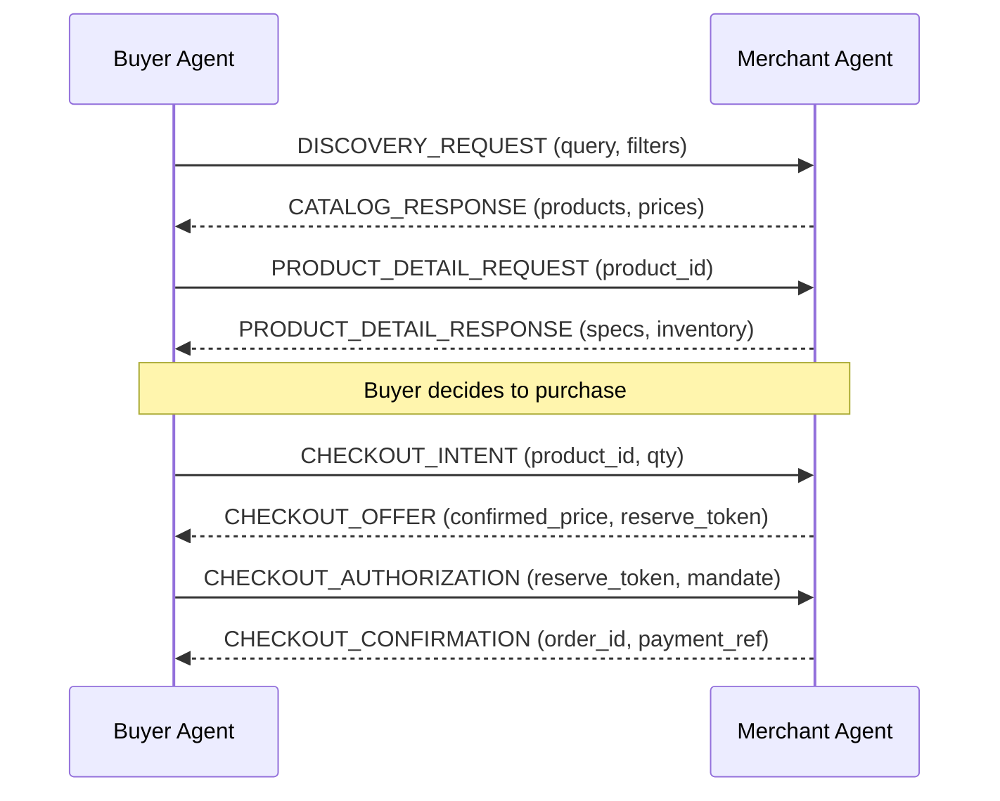
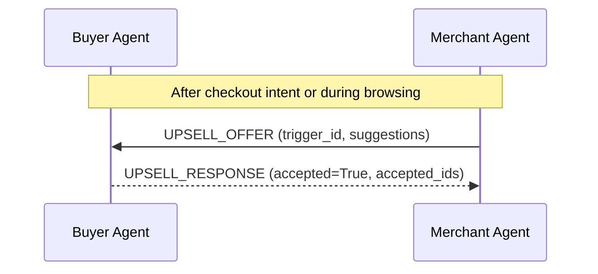
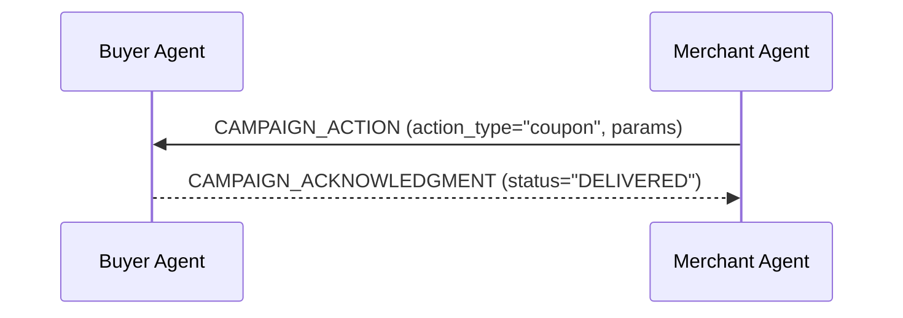
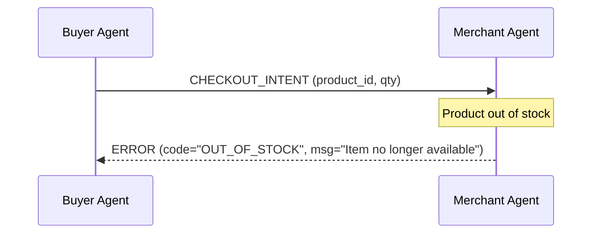

# RazorMesh Agent Communication Protocol (ACP)

> **IMPORTANT CONTEXT**: This document defines the **RazorMesh ACP**, a lightweight agent-to-agent protocol designed specifically for the Razorpay AI Buildathon prototype. We are **NOT** implementing the official Agent Communication Protocol (ACP) by OpenAI/Stripe or the Universal Commerce Protocol (UCP) by Google/Shopify. This is our own prototype protocol inspired by these concepts.

## 1. Protocol Overview

The RazorMesh Agent Communication Protocol (ACP) is a structured message protocol used between the **Buyer Agent** and the **Merchant Agent**. 

**Purpose**: To enable structured, auditable, and bounded communication between agents representing consumers and merchants.

Unlike traditional direct function calling, messages in RazorMesh flow through a dedicated protocol layer. This ensures that every interaction is explicit, trackable, and verifiable, mimicking how distributed systems communicate securely. It distinguishes our prototype from official industry standards by being specifically tailored and simplified for the buildathon use case while retaining the core tenets of agentic commerce.

## 2. Message Envelope

All communication between agents happens via a universal message envelope. This ensures that every message can be routed, tracked, and audited consistently.

```python
from pydantic import BaseModel, Field, UUID4
from datetime import datetime
from typing import Any, Optional

class MessageEnvelope(BaseModel):
    message_id: UUID4 = Field(..., description="Unique identifier for the message")
    correlation_id: UUID4 = Field(..., description="Links related messages in a conversation/flow")
    sender_agent_id: str = Field(..., description="ID of the agent sending the message")
    recipient_agent_id: str = Field(..., description="ID of the agent receiving the message")
    message_type: str = Field(..., description="Enum defining the type of message")
    timestamp: datetime = Field(default_factory=datetime.utcnow, description="ISO 8601 UTC timestamp")
    payload: Any = Field(..., description="Message-specific payload")
    signature: Optional[str] = Field(None, description="Optional cryptographic signature for audit/verification")
    idempotency_key: str = Field(..., description="Key to prevent processing duplicate messages")
    version: str = Field("1.0.0", description="Protocol version")
```

## 3. Message Types

Messages are defined by their `message_type` and have specific `payload` schemas.

### Discovery Flow

**DISCOVERY_REQUEST**: Buyer wants products matching criteria.
```python
class DiscoveryRequestPayload(BaseModel):
    query: str
    filters: dict[str, Any]  # e.g., {"category": "electronics", "price_range": [1000, 50000], "features": ["wireless"]}
    limit: int = 10
```

**CATALOG_RESPONSE**: Merchant returns matching products.
```python
class ProductSummary(BaseModel):
    product_id: str
    name: str
    price: int  # in paise
    currency: str = "INR"
    brief_description: str

class CatalogResponsePayload(BaseModel):
    products: list[ProductSummary]
    total_count: int
    merchant_id: str
    offer_valid_until: datetime
```

### Product Detail Flow

**PRODUCT_DETAIL_REQUEST**: Buyer wants full details on a specific product.
```python
class ProductDetailRequestPayload(BaseModel):
    product_id: str
```

**PRODUCT_DETAIL_RESPONSE**: Merchant returns full product spec.
```python
class ProductDetailResponsePayload(BaseModel):
    product_id: str
    name: str
    description: str
    specifications: dict[str, str]
    price: int
    currency: str = "INR"
    inventory_status: str  # "IN_STOCK", "OUT_OF_STOCK", "PREORDER"
```

### Checkout Flow

**CHECKOUT_INTENT**: Buyer signals intent to purchase.
```python
class CheckoutIntentPayload(BaseModel):
    product_id: str
    quantity: int
    buyer_mandate_ref: Optional[str]
```

**CHECKOUT_OFFER**: Merchant confirms price, availability, and terms.
```python
class CheckoutOfferPayload(BaseModel):
    product_id: str
    confirmed_price: int  # Total price for requested quantity in paise
    stock_reserved: bool
    reservation_token: str
    reservation_expiry: datetime
    terms: str
```

**CHECKOUT_AUTHORIZATION**: Buyer confirms purchase authorization.
```python
class CheckoutAuthorizationPayload(BaseModel):
    reservation_token: str
    mandate_id: str
    authorized_amount: int
```

**CHECKOUT_CONFIRMATION**: Merchant confirms order created.
```python
class CheckoutConfirmationPayload(BaseModel):
    order_id: str
    payment_ref: str
    estimated_delivery: str
```

### Upsell/Cross-sell Flow

**UPSELL_OFFER**: Merchant proactively suggests related products.
```python
class UpsellOfferPayload(BaseModel):
    trigger_product_id: str
    suggested_products: list[ProductSummary]
    reason: str  # e.g., "Frequently bought together"
    campaign_id: Optional[str]
```

**UPSELL_RESPONSE**: Buyer accepts or rejects the upsell.
```python
class UpsellResponsePayload(BaseModel):
    accepted: bool
    accepted_product_ids: list[str] = []
```

### Campaign Flow

**CAMPAIGN_ACTION**: Merchant triggers a campaign action.
```python
class CampaignActionPayload(BaseModel):
    campaign_id: str
    action_type: str  # "coupon", "reminder", "review_request", "reorder_prompt"
    target_user_id: str
    parameters: dict[str, Any]
```

**CAMPAIGN_ACKNOWLEDGMENT**: Buyer agent acknowledges the campaign.
```python
class CampaignAcknowledgmentPayload(BaseModel):
    campaign_id: str
    status: str  # "DELIVERED", "IGNORED", "ACTED_UPON"
```

### Error/Status

**ERROR**: Structured error with code and message.
```python
class ErrorPayload(BaseModel):
    code: str
    message: str
    details: Optional[dict[str, Any]]
```

**STATUS_UPDATE**: Order or fulfillment status updates.
```python
class StatusUpdatePayload(BaseModel):
    order_id: str
    status: str  # e.g., "PROCESSING", "SHIPPED", "DELIVERED"
    tracking_url: Optional[str]
```

## 4. Protocol Flows

### Discovery → Comparison → Checkout Flow


### Upsell Flow


### Campaign Flow


### Error/Retry Flow


## 5. Idempotency

- Every message MUST include an `idempotency_key`.
- Receivers must handle duplicate messages gracefully by checking the `idempotency_key` against recently processed messages.
- **Idempotency Semantics**:
  - `DISCOVERY_REQUEST` / `PRODUCT_DETAIL_REQUEST`: Safe to re-process, but cacheable.
  - `CHECKOUT_INTENT`: Repeated intents with the same key should return the exact same `CHECKOUT_OFFER` (same reservation token).
  - `CHECKOUT_AUTHORIZATION`: Repeated authorizations with the same key should not trigger multiple payments; should return the existing `CHECKOUT_CONFIRMATION`.

## 6. Protocol Constraints

- **Currency**: All monetary amounts MUST be represented in the smallest currency unit (e.g., paise for INR).
- **Time**: All timestamps MUST be in ISO 8601 UTC format.
- **Serialization**: Messages MUST be strictly serializable to JSON.
- **Size Limit**: The total size of the Message Envelope (including payload) MUST NOT exceed 1MB.
- **Message TTL**: Messages have an implicit Time-To-Live (TTL) of 5 minutes. Receivers SHOULD drop messages if `timestamp` is older than 5 minutes from current UTC time.

## 7. Relationship to Industry Standards

| Feature | RazorMesh ACP (Prototype) | Industry Standards (ACP/UCP/AP2) |
|---------|---------------------------|----------------------------------|
| **Scope** | Point-to-point buyer/merchant agent communication | Cross-platform, universal interoperability |
| **Transport** | JSON over HTTP/WebSockets (Simulated) | Standardized APIs, Webhooks, Decentralized networks |
| **Complexity** | Lightweight, fixed schema per flow | Highly extensible, capability negotiation |
| **Authentication** | Basic sender/receiver ID mapping | mTLS, OAuth2, Cryptographic verifiable credentials |
| **State Mgt** | Simplified correlation IDs | Complex state machines and session handshakes |

**Borrowed Concepts**:
- Unified message envelopes with correlation IDs.
- Distinct separation of intent (Discovery -> Offer -> Authorization -> Confirmation).
- Idempotency as a first-class citizen.

**Simplifications for the Prototype**:
- Rigid payload structures instead of dynamic capability discovery.
- Omitted cryptographic handshakes and complex mandate negotiation.
- Reduced edge-case handling (e.g., partial refunds, complex multi-merchant routing).

**Path to Evolve**:
As the prototype matures, this protocol could adopt full schema registries, capability negotiation endpoints (so agents can query what standard an opposing agent supports), and robust verifiable credentials to transition towards true ACP/UCP compliance.
